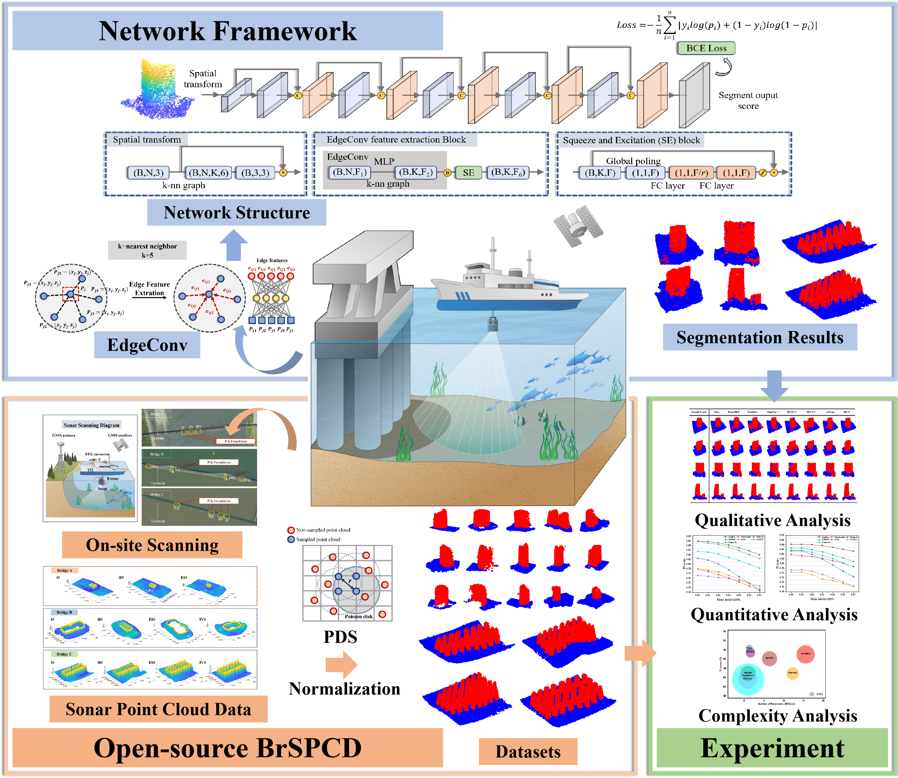

# Bridge Sonar Point Cloud Dataset (BrSPCD) Version_1.0


## ⚡Paper
The BrSPCD dataset was first introduced in the paper "*Lightweight learning-based sonar point cloud semantic segmentation for underwater bridge inspection*", authored by Zelin Huang, Yanjie Zhu, Wen Xiong*, and Shuaihui Zhang. It was designed to train and evaluate the performance of semantic segmentation algorithms for underwater bridge sonar point clouds.
[Paper Link](https://www.sciencedirect.com/science/article/pii/S0926580525004273?ref=pdf_download&fr=RR-2&rr=95c4746fbb8daf81 "Paper Link")

<p align="center">


At the time of BrSPCD’s release, the field lacked publicly available datasets due to the inherent complexities of underwater surveying. This significant gap severely limited the application of deep learning techniques in underwater bridge inspection.
## ✨BrSPCD

The uploaded dataset includes all 116 fragmented point cloud segments referenced in our publication, along with four complete scene datasets and three binarized datasets derived from other sources. Each compressed package, upon extraction, contains a standardized directory structure with the following three subfolders:
- PointCloud: stores point cloud files in text format, each containing n rows and 3 columns representing 3D coordinates.
- Label: contains label files with n rows and 1 column, where labels “0” and “1” correspond to two semantic classes.
- Visualization: includes .tif images for rapid visual inspection of the data.

<p align="center">

## 🔧Citation
If you find this work helpful please consider citing our paper:
```javascript
Zelin Huang, Yanjie Zhu, Wen Xiong, Shuaihui Zhang,
Lightweight learning-based sonar point cloud semantic segmentation for underwater bridge inspection,
Automation in Construction,
Volume 178,
2025,
106387,
ISSN 0926-5805,
https://doi.org/10.1016/j.autcon.2025.106387.
(https://www.sciencedirect.com/science/article/pii/S0926580525004273)
Abstract: Point cloud semantic segmentation of bridge foundations and underwater terrain is essential for structure inspection and scour monitoring. However, underwater environmental noise and rotational disturbances present significant challenges. The existing algorithms demonstrate limited robustness and lack a lightweight model. To address these limitations, a lightweight semantic segmentation network based on the dynamic graph convolutional neural network is proposed. The network employs edge convolutions for feature extraction, a Squeeze and Excitation block for feature refinement, and a densely connected structure enhancing the robustness. A bridge sonar point cloud dataset, BrSPCD, was created for training and evaluation. The experimental results demonstrate superior segmentation performance and robustness, with an F1 score decline of 4.87 % under maximum noise and a decline of 4.11 % under maximum rotational impact. Ablation studies validate the effectiveness of the attention block and dense connectivity. Additionally, complexity analysis shows an 85.02 % reduction in average runtime compared to existing methods.
Keywords: Bridge substructure inspection; Bridge sonar point cloud databank (BrSPCD); DGCNN; Piles segmentation; 3D sonar point cloud
```
